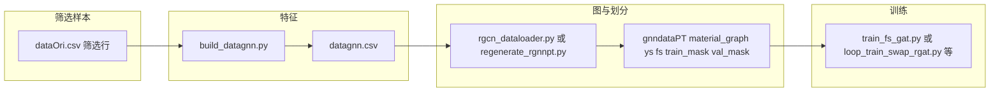

# gnnDir 使用说明

本目录包含 **datagnn 特征构建 → 异质图 PT → GNN 训练** 的脚本与默认数据路径。下文说明如何**筛选/划分数据集**以及如何**训练**。

## 目录结构（常用）

| 路径 | 作用 |
|------|------|
| [`build_datagnn.py`](build_datagnn.py) | 将原始表转为 `datagnn.csv`（30 维特征 + YS/FS） |
| [`rgcn_dataloader.py`](rgcn_dataloader.py) | 从 `datagnn.csv` 构图并导出 `material_graph.pt`、`ys.pt`、`fs.pt`（mask 随机划分或外部 mask） |
| [`regenerate_rgnnpt.py`](regenerate_rgnnpt.py) | 一键：`build_datagnn` + `rgcn_dataloader`，并把图中的 mask 导出为 `train_mask.pt` / `val_mask.pt` |
| [`gen_masks.py`](gen_masks.py) | 单独生成 `train_mask.pt` / `val_mask.pt`（随机或按行号索引文件） |
| [`datacsv/datagnn.csv`](datacsv/datagnn.csv) | 默认的特征与标签表（可由脚本生成） |
| [`gnndataPT/r-gatPT/`](gnndataPT/) | RGAT 默认 PT 包目录 |
| [`gnndataPT/r-gnnPT/`](gnndataPT/) | R-GCN 默认 PT 包目录 |
| [`gnn/r-gatDouble/`](gnn/r-gatDouble/) | 双头 RGAT 训练（`train_fs_gat.py`、`loop_train_swap_rgat.py`） |
| [`gnn/r-gnn/`](gnn/r-gnn/) | R-GCN 训练 |
| [`gnndataPT/checkpython/checkval.py`](gnndataPT/checkpython/checkval.py) | 对照 CSV 查看 `val_mask` 对应样本（调试用） |

依赖：`torch`、`torch_geometric`、`pandas`、`numpy`；`build_datagnn.py` 还依赖 [`pt_dataset.py`](../pt_dataset.py)（须位于**仓库根目录**，与 `gnnDir/` 同级；若仅有本目录，请从主仓库复制该文件到根目录或加入 `PYTHONPATH`）。

---

## 一、如何筛选数据集

「数据集」在此流水线中指 **参与构图与训练的样本行**。筛选发生在 **原始 CSV** 阶段最有效。

### 1. 原始输入：`dataOri.csv`

[`build_datagnn.py`](build_datagnn.py) 默认读取 **`symtest/dataOri.csv`**（可用 `--input` 指定其它文件）。

原始表须包含下列列（名称固定）：

- **元素（10）**：`Al`, `Zr`, `Sn`, `Mo`, `Cr`, `Nb`, `Si`, `V`, `Ta`, `Fe`
- **试验环境（2）**：`tem`, `fcr`
- **工艺 coldway（15）**：`T1`, `t1`, `T2`, `t2`, `T3`, `t3`, `C1_1` … `C3_3`（与脚本中 `COLDWAY_COLS` 一致）
- **目标（2）**：`YS`, `FS`

**筛选方式**：在 Excel / 脚本中删除或保留行，保存为新的 CSV，再用 `--input` 指向该文件。**行顺序即为图中节点索引**（第 0 行对应节点 0），后续若用手写 train/val 索引文件，必须与当前 `datagnn.csv` 行号一致。

### 2. 生成建模用表：`datagnn.csv`

```bash
cd symbolTransformer/symtest/gnnDir
python build_datagnn.py --input /path/to/your_filtered_dataOri.csv --output datacsv/datagnn.csv
```

输出：

- `datagnn.csv`：`element_0..9`、`testenv_0..1`、`coldway_0..17`、`YS`、`FS`
- `datacsv/testenv_stats.csv`：`tem`/`fcr` 标准化用的均值与标准差（便于还原）

不对样本做「筛选」时，可直接使用仓库里已有 [`datacsv/datagnn.csv`](datacsv/datagnn.csv)。

### 3. 训练集 / 验证集划分（三种常用方式）

划分对象是当前 **`datagnn.csv` 的 N 行**（N 个节点），且 **train 与 val 不得重叠、并须覆盖全部节点**（除非后续训练脚本显式允许 inactive，见各 `train_*.py` 的 `--allow-inactive`）。

**方式 A — 随机划分（默认）**

在 [`rgcn_dataloader.py`](rgcn_dataloader.py) 或 [`regenerate_rgnnpt.py`](regenerate_rgnnpt.py) 中使用：

- `--train-ratio`：训练比例，默认 `0.8`
- `--split-seed`：随机种子，默认 `42`

例如一键重生 PT 包：

```bash
python regenerate_rgnnpt.py --pt-bundle rgat --train-ratio 0.8 --split-seed 42
```

**方式 B — 外部 mask 文件**

预先用布尔向量指定每个节点属于 train 还是 val（长度均为 N）：

- `--train-mask-path`、`--val-mask-path`：指向 `.pt` / `.npy` / `.csv`（详见 `rgcn_dataloader.py` 中 `_load_mask_file`）

适用于论文固定划分或可复现实验。

**方式 C — `gen_masks.py` 单独生成 mask**

```bash
# 随机划分，604 节点示例（请改为与你当前 datagnn 行数一致）
python gen_masks.py --mode random --num-nodes 604 --train-ratio 0.8 --seed 42 \
  --out-train-mask gnndataPT/r-gatPT/train_mask.pt \
  --out-val-mask gnndataPT/r-gatPT/val_mask.pt

# 按行索引文本划分（每行一个整数索引，也可用逗号分隔）
python gen_masks.py --mode index --num-nodes 604 \
  --train-idx-path train_indices.txt \
  --val-idx-path val_indices.txt \
  --out-train-mask gnndataPT/r-gatPT/train_mask.pt \
  --out-val-mask gnndataPT/r-gatPT/val_mask.pt
```

生成后再运行 `rgcn_dataloader.py` 并传入上述两个 mask 路径，或在一个完整的 `regenerate_rgnnpt.py` 调用里传入 `--train-mask-path` / `--val-mask-path`。

### 4. 构图相似度阈值（影响边，不是样本筛选）

[`rgcn_dataloader.py`](rgcn_dataloader.py) 用成分 / 环境 / coldway 相似度建边，可通过下列参数调整（默认多为 **0.8**）：

- `--element-thr`、`--testenv-thr`、`--coldway-thr`

阈值越高，边越稀疏。导出 PT 后若再次修改阈值，需重新导出图与 mask（或保证与推理脚本一致）。

---

## 二、如何生成 PT 数据包

推荐一键脚本（从 `dataOri` 重算 `datagnn.csv` 并写入 `gnndataPT/...`）：

```bash
cd symbolTransformer/symtest/gnnDir

# RGAT 使用目录 gnndataPT/r-gatPT
python regenerate_rgnnpt.py --pt-bundle rgat --dataori ../dataOri.csv --datagnn-csv datacsv/datagnn.csv

# R-GCN 使用 gnndataPT/r-gnnPT
python regenerate_rgnnpt.py --pt-bundle rgnn
```

常用选项：

- `--skip-build-datagnn`：跳过第一步，直接使用已有 `datagnn.csv`
- `--element-thr` / `--testenv-thr` / `--coldway-thr`、`--train-ratio`、`--split-seed`
- `--train-mask-path`、`--val-mask-path`：自定义划分
- `--keep-loop-state`：不删除 `gnn/*/runs` 里 mask 循环的状态文件（默认会清掉以便下一轮从 round 1 开始）

成功后目录内应有（示例 RGAT）：

- `material_graph.pt`、`ys.pt`、`fs.pt`、`train_mask.pt`、`val_mask.pt`

---

## 三、如何训练

以下均在 **`gnnDir`** 下执行，且需已准备好对应 **`gnndataPT/...`** 中的 5 个 PT 文件。

### 1. 双头 RGAT（YS + FS）

目录：[gnn/r-gatDouble/](gnn/r-gatDouble/)

**单次训练（保存最优 checkpoint）：**

```bash
cd symbolTransformer/symtest/gnnDir/gnn/r-gatDouble
python train_fs_gat.py \
  --data-dir ../../gnndataPT/r-gatPT \
  --epochs 1000 \
  --lr 1e-3 \
  --hidden-dim 64 \
  --weight-decay 1e-4 \
  --dropout 0.2 \
  --seed 42 \
  --out-dir ./runs
```

产出示例：`runs/best_ysfs_gat.pt`、`runs/train_log.csv`。

**带 mask 交换 / curate 的多轮循环训练：**

```bash
python loop_train_swap_rgat.py \
  --data-dir ../../gnndataPT/r-gatPT \
  --epochs-per-round 100 \
  --out-dir ./runs \
  --max-rounds 0
```

`--max-rounds 0` 表示无限轮直到 Ctrl+C；详见脚本 `--help`（`--max-curate`、`--swap-batch-size` 等）。

更详细的损失与指标说明见 [gnn/r-gatDouble/README.md](gnn/r-gatDouble/README.md)。

### 2. R-GCN（以 FS 为主等）

目录：[gnn/r-gnn/](gnn/r-gnn/)

```bash
cd symbolTransformer/symtest/gnnDir/gnn/r-gnn
python train_fs_rgcn.py --data-dir ../../gnndataPT/r-gnnPT --out-dir ./runs ...
```

循环版本：`loop_train_swap_rgcn.py`。说明见 [gnn/r-gnn/README.md](gnn/r-gnn/README.md)。

### 3. 其它变体

- `gnn/r-gatFS/`：单 FS 头 RGAT  
- `gnn/r-gatDymDoub/`：动态双分支等扩展  

各自目录内一般有 `README.md` 或 `train_*.py --help`。

---

## 四、流程串联简图



---

## 五、常见问题

1. **改数据后训练结果变了**  
   检查是否重新跑了 `build_datagnn.py` / `regenerate_rgnnpt.py`，以及 `--split-seed`、`train-ratio` 是否与上次一致。

2. **mask 与 CSV 行对不齐**  
   `material_graph.pt` 中节点顺序与当前 `datagnn.csv` 行顺序一致；换 CSV 后必须重新导出 PT 与 mask。

3. **只想换划分、不换图结构**  
   可在同一 `datagnn.csv` 上改 `--train-ratio` / `--split-seed`，或用手写 `train_mask.pt`/`val_mask.pt` 再跑 `rgcn_dataloader.py`（不必改相似度阈值）。

更多推理侧说明（读 checkpoint、自动建边）见仓库内 `symwithgnn/gnn/README.md`（若已同步）。
