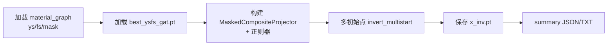

# grd：GNN 全特征梯度反推

基于 **已训练** 的 `SingleEncoder_DualRGAT`（`gnnDir/gnn/r-gatDouble`），对图中每个节点的 **30 维输入特征** 做梯度反推，使模型预测的 **YS / FS** 逼近给定目标。  
默认用真实标签做 **还原验证**；也可指定目标性能做 **设计反推**。

---

## 目录

- [背景与问题定义](#背景与问题定义)
- [特征布局（30 维）](#特征布局30-维)
- [目录结构](#目录结构)
- [工作流程](#工作流程)
- [快速开始](#快速开始)
- [命令行参数](#命令行参数)
- [输出文件](#输出文件)
- [模块说明](#模块说明)
- [Python API 示例](#python-api-示例)
- [依赖与环境](#依赖与环境)
- [常见问题](#常见问题)

---

## 背景与问题定义

正向模型（已训练、参数冻结）：

```text
x (N, 30)  +  edge_index, edge_type  →  GNN  →  ys_pred, fs_pred  (N,)
```

反推问题：固定 GNN 权重，优化 **全图** 的 `x`，最小化

```text
MSE(ys_pred, target_ys) + MSE(fs_pred, target_fs) + 正则项
```

并在每步（或按间隔）将 `x` **硬投影** 到物理可行域（组分非负、Ti 余量、testenv/coldway 上下界等）。

> **图耦合**：RGAT 消息传递使所有节点特征在梯度上相互影响；优化变量仍是全图 `x`，即使重建损失只算 `val` 子集（`--recon-mask-mode val`），训练节点的 `x` 仍会间接影响验证节点预测。

---

## 特征布局（30 维）

与 `gnnDir/gnndataPT/r-gatPT/material_graph.pt` 中 `sample.x` **完全一致**。

| 维段 | 索引 | 列含义 | 反推约束 | 说明 |
|------|------|--------|----------|------|
| element | 0–9 | Al, Zr, Sn, Mo, Cr, Nb, Si, V, Ta, Fe | **A 模式** `ti_balance` | wt% 量级；非负；行和 ≤ `total_wt`（默认 100） |
| testenv | 10–11 | tem, fcr | 训练分位数 **box** | **z-score**，与训练一致；物理还原用 `testenv_stats.csv` |
| coldway | 12–29 | 18 维工艺特征 | 训练分位数 **box** | 与 `build_datagnn` 变换后空间一致 |

### 钛余量 A 模式

Ti **不在** 30 维向量内，由后处理计算：

```text
Ti(wt%) = total_wt - sum(element_0..9)    # 默认 total_wt = 100
```

结果写入 `x_inv.pt` 的 `ti_balance_inv` / `ti_balance_true`。

---

## 目录结构

```text
grd/
├── __init__.py           # 包导出
├── io_utils.py           # 加载 PT 数据、合并异质边、加载 checkpoint
├── feature_layout.py     # 30 维布局、分位数 box、Ti 计算、默认投影器
├── masked_projector.py   # 按维段硬投影（element / testenv / coldway）
├── gnn_inverter.py       # 核心优化器：正则、投影、多初始点、Benchmark
├── run_inversion.py      # 命令行入口（推荐）
├── summary_report.py     # 生成 inversion_summary.json / .txt
├── outputs/              # 默认输出目录（.gitignore 可忽略大文件）
└── README.md             # 本文档
```

---

## 工作流程



1. `io_utils.load_graph_bundle`：读 `x, ys, fs, train_mask, val_mask`
2. `io_utils.merge_hetero_edges`：`comp_sim/env_sim/heat_sim` → `edge_index`, `edge_type`
3. `feature_layout.bounds_from_train_x`：testenv/coldway 训练分位数 box
4. `GNNInverter.invert_multistart`：Adam 优化 + 投影 + 早停
5. `summary_report`：汇总指标与中文说明

---

## 快速开始

### 1. 环境

```bash
# 参考 gnnDir/requirements.txt
pip install torch torch-geometric pandas numpy
```

### 2. 数据与模型（仓库默认路径）

| 资源 | 路径 |
|------|------|
| 图数据包 | `gnnDir/gnndataPT/r-gatPT/` |
| 检查点 | `gnnDir/gnn/r-gatDouble/runs/best_ysfs_gat.pt` |
| 模型定义 | `gnnDir/gnn/r-gatDouble/model_gat_double.py` |
| testenv 统计 | `gnnDir/datacsv/testenv_stats.csv` |

### 3. 运行反推（推荐 GPU）

在**仓库根目录**执行：

```bash
python -m grd.run_inversion \
  --data-dir gnnDir/gnndataPT/r-gatPT \
  --ckpt gnnDir/gnn/r-gatDouble/runs/best_ysfs_gat.pt \
  --rgat-dir gnnDir/gnn/r-gatDouble \
  --out-dir grd/outputs
```

### 4. 本地同步远端分支

```bash
git fetch origin meta4TiiGnn
git checkout meta4TiiGnn
git pull origin meta4TiiGnn
```

---

## 命令行参数

| 参数 | 默认 | 说明 |
|------|------|------|
| `--data-dir` | `gnnDir/gnndataPT/r-gatPT` | PT 数据目录 |
| `--ckpt` | `.../best_ysfs_gat.pt` | 模型权重 |
| `--rgat-dir` | `.../r-gatDouble` | 含 `model_gat_double.py` 的目录 |
| `--out-dir` | `grd/outputs` | 输出目录 |
| `--device` | `cuda`（不可用则 cpu） | 计算设备 |
| `--force-cpu` | 关 | 强制 CPU；默认仅 `training_mean` 初始化 |
| `--total-wt` | `100` | Ti A 模式总量标尺（wt%） |
| `--target-mode` | `ground_truth` | `ground_truth` 或 `model_forward` |
| `--recon-mask-mode` | `none` | 重建损失节点范围：`none` / `val` / `train` |
| `--node-mask` | `val` | **评估**特征 MAE 的节点子集（不影响优化范围） |
| `--max-iters` | `1500` | 最大迭代步数 |
| `--lr` | `0.05` | Adam 学习率 |
| `--lambda-smooth` | `0.08` | 图平滑正则（仅 `comp_sim` 边，关系 id=0） |
| `--lambda-anchor` | `0.15` | L2 锚定到训练 `x` |
| `--patience` | `200` | 早停耐心值 |
| `--recon-tol` | `1e-5` | 重建 MSE 容限 |
| `--margin` | `0.05` | 训练分位数 box 外扩比例 |
| `--tem-lower/upper` | 无 | 物理温度界（需 `testenv_stats.csv` 转 z） |
| `--fcr-lower/upper` | 无 | 物理 fcr 界 |
| `--inits` | 空（全部） | 逗号分隔：`training_mean,dirichlet,random_normal,zero` |
| `--seed` | `42` | 随机种子 |

**示例：仅在验证集节点上算重建损失（减轻标签泄露风险）**

```bash
python -m grd.run_inversion \
  --recon-mask-mode val \
  --target-mode ground_truth
```

**示例：指定物理温度上下界（反推仍在 z-score 空间）**

```bash
python -m grd.run_inversion \
  --tem-lower 25 --tem-upper 600 \
  --testenv-stats gnnDir/datacsv/testenv_stats.csv
```

---

## 输出文件

| 文件 | 内容 |
|------|------|
| `x_inv.pt` | 主结果：`x_inv`, `x_true`, `ti_balance_*`, `ys_pred`, `fs_pred`, `bounds` 等 |
| `inversion_summary.json` | 指标汇总 + `field_descriptions` 各字段中文说明 |
| `inversion_summary.txt` | 人类可读报告，每项带中文解释 |

### `x_inv.pt` 主要字段

| 键 | 形状 | 说明 |
|----|------|------|
| `x_inv` | (N, 30) | 反推特征，与 `material_graph` 同格式 |
| `x_true` | (N, 30) | 原始真值 |
| `ti_balance_inv` | (N,) | Ti(wt%) = total_wt - sum(元素) |
| `ti_balance_true` | (N,) | 真值对应的 Ti |
| `target_ys`, `target_fs` | (N,) | 反推目标 |
| `ys_pred`, `fs_pred` | (N,) | 用 `x_inv` 前向得到 |
| `element_names` | 10 | 元素名列表 |

加载示例：

```python
import torch
d = torch.load("grd/outputs/x_inv.pt", map_location="cpu", weights_only=False)
x_inv = d["x_inv"]
ti = d["ti_balance_inv"]
```

---

## 模块说明

### `io_utils.py`

| 函数 | 作用 |
|------|------|
| `_ensure_rgat_double_on_path` | 将 r-gatDouble 加入 `sys.path` |
| `load_graph_bundle` | 加载 `x, ys, fs, train_mask, val_mask` |
| `merge_hetero_edges` | 异质边合并为 `edge_index` + `edge_type` |
| `load_dual_rgat` | 加载 `SingleEncoder_DualRGAT` 并 `eval()` |

### `feature_layout.py`

| 符号 / 函数 | 作用 |
|-------------|------|
| `ELEMENT_DIM`, `INPUT_DIM`, `ELEMENT_NAMES` | 维段常量 |
| `compute_ti_balance` | 计算 Ti 余量 (N,) |
| `bounds_from_train_x` | 训练集分位数 box |
| `bounds_with_physical_testenv` | 物理 tem/fcr → z-score 界 |
| `build_projector` | 默认 `MaskedCompositeProjector` |

### `masked_projector.py`

| 类 / 函数 | 作用 |
|-----------|------|
| `FeatureSliceSpec` | 一段特征的投影类型与界 |
| `_project_ti_balance_rows` | 元素非负 + 行和 ≤ total_wt |
| `MaskedCompositeProjector` | 对 30 维按段依次投影 |

投影类型：`ti_balance` | `box` | `simplex` | `scaled_simplex` | `nonnegative` | `none`

### `gnn_inverter.py`（核心）

| 类 | 作用 |
|----|------|
| `GNNInverterConfig` | 优化器、正则权重、投影、早停等超参 |
| `SmoothnessRegularizer` | 图平滑（可限 `target_edge_types`，默认仅组分边 0） |
| `SparsityRegularizer` | L1 稀疏（默认权重极小） |
| `AnchorRegularizer` | L2 锚定到训练 `x` |
| `PhysicalPenaltyRegularizer` | 软非负/行和惩罚（联合反推时默认权重为 0） |
| `GNNInverter` | `invert_single` / `invert_multistart` / `_compute_loss` |
| `GNNInversionBenchmark` | 多场景对比（可选） |

要点：

- **Adam**：按 `projection_interval` 做硬投影；支持 `recon_mask` 限定重建损失节点。
- **LBFGS**：步前/步后投影；closure 内不做梯度裁剪，避免破坏曲率估计。
- `best_x` 取优化过程中总损失最小的快照；最终指标在 `best_x` 上评估。

### `run_inversion.py`

命令行入口：组装数据、投影器、正则、`invert_multistart`、写三类输出。

### `summary_report.py`

| 函数 | 作用 |
|------|------|
| `build_summary_dict` | 组装 JSON 可序列化汇总 |
| `write_summary_json` | 写 `inversion_summary.json` |
| `write_summary_txt` | 写带中文说明的 `inversion_summary.txt` |

---

## Python API 示例

```python
from pathlib import Path
import torch

from grd.feature_layout import bounds_from_train_x, build_projector, compute_ti_balance
from grd.gnn_inverter import (
    AnchorRegularizer,
    GNNInverter,
    GNNInverterConfig,
    SmoothnessRegularizer,
    TrainingMeanInitializer,
)
from grd.io_utils import load_dual_rgat, load_graph_bundle, merge_hetero_edges

data_dir = Path("gnnDir/gnndataPT/r-gatPT")
device = "cuda"

x, ys, fs, train_mask, val_mask = load_graph_bundle(data_dir)
graph = torch.load(data_dir / "material_graph.pt", weights_only=False)
edge_index, edge_type = merge_hetero_edges(graph)
edge_index, edge_type = edge_index.to(device), edge_type.to(device)

model, _ = load_dual_rgat(
    Path("gnnDir/gnn/r-gatDouble/runs/best_ysfs_gat.pt"),
    Path("gnnDir/gnn/r-gatDouble"),
    device,
)

bounds = bounds_from_train_x(x, train_mask)
projector = build_projector(x, bounds, total_wt=100.0)

cfg = GNNInverterConfig(
    device=device,
    projectors=[],
    lambda_nonneg=0.0,
    lambda_sum1=0.0,
    input_dim=30,
)
inverter = GNNInverter(
    model=model,
    config=cfg,
    regularizers=[
        SmoothnessRegularizer(0.08, target_edge_types=[0]),
        AnchorRegularizer(0.15),
    ],
    projector=projector,
    anchor=x,
)

init = TrainingMeanInitializer(0.2).generate((x.shape[0], 30), x, device)
result = inverter.invert_single(
    ys.to(device), fs.to(device),
    edge_index, edge_type,
    init, init_name="api_demo",
    recon_mask=val_mask.to(device),  # 可选
)

ti = compute_ti_balance(result.x_inv, 100.0)
print(result.final_recon_mse, ti[:3])
```

---

## 依赖与环境

- Python 3.10+
- `torch`, `torch-geometric`, `pandas`, `numpy`（版本见 `gnnDir/requirements.txt`）
- 全图约 **604 节点、27 万条边**，**强烈建议 NVIDIA GPU（≥16GB 显存）**
- CPU：可用 `--force-cpu --inits training_mean --max-iters 200`，仍可能内存不足

---

## 常见问题

**Q：反推的 testenv 是物理温度吗？**  
A：不是。`x[:, 10:12]` 为 **z-score**；物理量用 `testenv_stats.csv` 自行还原：`x_phys = z * std + mean`。

**Q：为什么 element 行和不是 100？**  
A：10 维是 **合金化元素** Al…Fe 的 wt%；Ti 余量单独在 `ti_balance_*` 里，使「元素之和 + Ti ≈ 100」。

**Q：`--recon-mask-mode val` 与 `--node-mask val` 区别？**  
A：`recon-mask-mode` 影响 **优化时的重建损失**；`node-mask` 只影响 **事后报告的特征 MAE**，不改变优化。

**Q：未配置投影器会怎样？**  
A: `GNNInverter` 会打警告；`run_inversion` 始终传入 `MaskedCompositeProjector`，一般可忽略。

**Q：多初始点选哪个？**  
A：`invert_multistart` 在全部初始点跑完后，取 **`final_recon_mse` 最小** 的一次（见 `result.init_name`）。

---

## 版本与分支

- 开发分支历史：`cursor/grd-full-inversion-d67c`（已合并入 `meta4TiiGnn`）
- 使用模型：`SingleEncoder_DualRGAT`（`RGAT_Dual` 别名）
- 输入维度：**30**（与当前 `datagnn` / `material_graph` 一致）

如有新数据或 `in_dim` 变更，需重新训练 GNN 并同步修改 `feature_layout.INPUT_DIM` 与投影配置。
