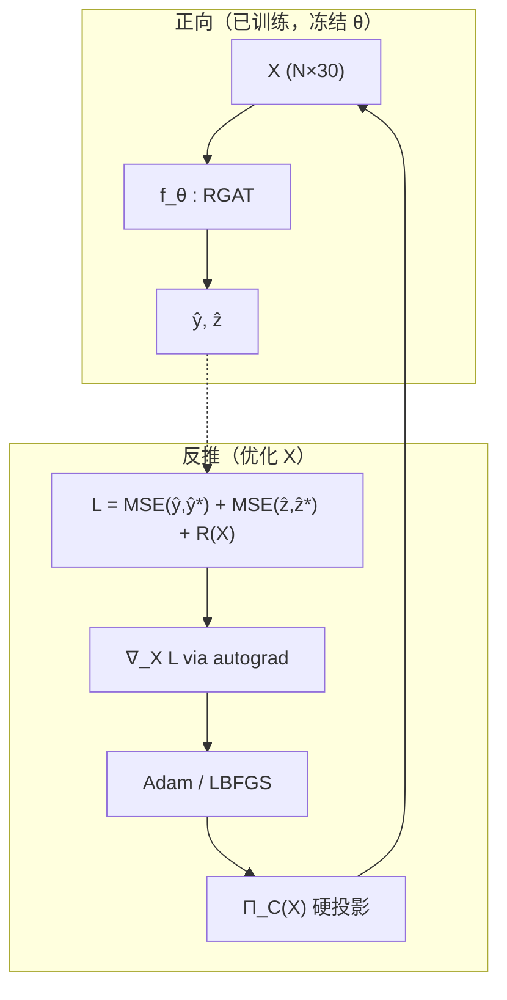

# grd：GNN 全特征梯度反推

基于 **已训练** 的 `SingleEncoder_DualRGAT`（`gnnDir/gnn/r-gatDouble`），对图中每个节点的 **30 维输入特征** 做梯度反推，使模型预测的 **YS / FS** 逼近给定目标。

---

## 文档导航

| 文档 | 说明 |
|------|------|
| **本文** | 总览、**算法原理**、参考文献、快速开始 |
| [docs/README.md](./docs/README.md) | **各 Python 文件** 的独立说明索引 |

| 源文件 | 独立 README |
|--------|-------------|
| `__init__.py` | [docs/__init__.md](./docs/__init__.md) |
| `io_utils.py` | [docs/io_utils.md](./docs/io_utils.md) |
| `feature_layout.py` | [docs/feature_layout.md](./docs/feature_layout.md) |
| `masked_projector.py` | [docs/masked_projector.md](./docs/masked_projector.md) |
| `gnn_inverter.py` | [docs/gnn_inverter.md](./docs/gnn_inverter.md) |
| `run_inversion.py` | [docs/run_inversion.md](./docs/run_inversion.md) |
| `summary_report.py` | [docs/summary_report.md](./docs/summary_report.md) |

---

## 特征布局（30 维）

与 `gnnDir/gnndataPT/r-gatPT/material_graph.pt` 中 `sample.x` **完全一致**。

| 维段 | 索引 | 约束 |
|------|------|------|
| element | 0–9 | **A 模式**：非负，行和 ≤ 100 wt%；`Ti = 100 − sum`（见 `ti_balance_*`） |
| testenv | 10–11 | 训练分位数 box（**z-score**） |
| coldway | 12–29 | 训练分位数 box |

元素列：`Al, Zr, Sn, Mo, Cr, Nb, Si, V, Ta, Fe`。详见 [docs/feature_layout.md](./docs/feature_layout.md)。

---

## 算法原理

本节说明 `grd` 在数学上在做什么、与常见机器学习/优化文献的对应关系，以及为何采用当前工程实现。

### 1. 问题类型：冻结神经网络下的输入反演

正向模型 \(f_\theta\) 为已训练的 GNN（参数 \(\theta\) 固定），输入为全图特征矩阵 \(X \in \mathbb{R}^{N \times d}\)，输出节点级标量 \(y, z\)（YS、FS）：

\[
\hat{y}, \hat{z} = f_\theta(X;\, \mathcal{G})
\]

其中 \(\mathcal{G}=(V,E)\) 为材料相似度图（约 604 节点、\(10^5\) 量级边）。反演问题：求 \(X\) 使得 \(\hat{y}, \hat{z}\) 接近目标 \(y^\*, z^\*\)：

\[
\min_{X}\; \mathcal{L}(X)
= \underbrace{\|f_y(X)-y^\*\|^2 + \|f_z(X)-z^\*\|^2}_{\text{重建项}}
+ \underbrace{\sum_k \lambda_k \mathcal{R}_k(X)}_{\text{正则项}}
\quad
\text{s.t.}\quad X \in \mathcal{C}
\]

- **重建项**：对 MSE 在节点子集 \(\mathcal{M}\) 上求平均（`recon_mask`；默认全图）。
- **正则项**：先验与光滑性（见下）。
- **可行集 \(\mathcal{C}\)**：由 `MaskedCompositeProjector` 实现，分段 box + 钛合金组分约束。

这在文献中接近 **model inversion / input reconstruction from a fixed surrogate model**：用可微代理模型（此处为 GNN）反求输入，常见于可解释性、对抗样本与 **inverse design** 范式。与经典 **逆问题（inverse problems）** 中「从观测反演参数」结构相同，但这里观测是 YS/FS、参数是材料与工艺特征。

**不适定性（ill-posedness）**：不同 \(X\) 可能对应相近输出；解不唯一。因此需要正则、锚定与 **多初始点（multistart）**。



### 2. 优化算法：Adam 与 L-BFGS + 投影

#### 2.1 投影梯度法（Projected Gradient / Projected Quasi-Newton）

约束 \(X \in \mathcal{C}\) 通过 **投影** 满足，而非增广拉格朗日内层迭代：

\[
X_{t+1} = \Pi_{\mathcal{C}}\bigl( X_t - \eta_t \nabla_X \mathcal{L}(X_t) \bigr)
\]

- **Adam**（默认）：自适应步长的一阶方法，实现见 `GNNInverter.invert_single` 的 Adam 分支；每 `projection_interval` 步执行 \(\Pi_{\mathcal{C}}\)。
- **L-BFGS**（可选）：有限内存拟牛顿法，适合光滑或近似光滑问题；本实现在 **closure 前/后** 投影，且 **不在 closure 内做梯度裁剪**，以免破坏曲率对 \((s_k, y_k)\) 的估计（见代码注释 Fix-3/4）。

投影梯度法是非线性规划经典框架，参见 Bertsekas, *Nonlinear Programming*（第2版）第2章约束梯度方法。

#### 2.2 多初始点全局启发

`invert_multistart` 对多种 `Initializer` 各跑 `invert_single`，取 **验证重建 MSE 最小** 的解。这是应对非凸 \( \mathcal{L} \) 的 **multi-start 启发式**，不保证全局最优。

### 3. 正则项及其含义

| 正则 | 数学形式（示意） | 作用 |
|------|------------------|------|
| **图平滑** `SmoothnessRegularizer` | \(\sum_{(i,j)\in E_0} \|X_i - X_j\|_2^2\) | 仅在 **comp_sim** 边（`edge_type=0`）上惩罚，使组分在相似材料间平滑；避免 env/heat 边误约束 |
| **锚定** `AnchorRegularizer` | \(\|X - X_{\text{train}}\|_F^2\) | Tikhonov 型先验，拉回训练流形 |
| **L1** `SparsityRegularizer` | \(\|X\|_1\) | 默认权重极小；若启用应限定列（避免 wt% 被错误稀疏化） |
| **软物理** `PhysicalPenaltyRegularizer` | \(\mathrm{ReLU}(-X)^2 + (\mathbf{1}^\top X - 1)^2\) | 联合反推时默认 **关闭**（`lambda=0`），由硬投影代替 |

图平滑与 **图信号处理** 中的图拉普拉斯正则 \(X^\top L X\) 同类，见 Shuman et al., *IEEE Signal Processing Magazine*, 2013。

### 4. 硬约束与可行集 \(\mathcal{C}\)

#### 4.1 钛合金组分（A 模式，`ti_balance`）

对每行 \(x^{(e)} \in \mathbb{R}^{10}\)（Al…Fe）：

\[
x^{(e)} \ge 0,\quad \mathbf{1}^\top x^{(e)} \le T_{\text{total}}\ (=100\ \text{wt\%})
\]

若超过总量则整行等比缩放。**钛 Ti 不在向量内**：

\[
\text{Ti} = T_{\text{total}} - \mathbf{1}^\top x^{(e)}
\]

这是质量守恒在「只优化合金化元素」时的显式余量写法。

#### 4.2 testenv / coldway（box）

\[
x_j \in [l_j, u_j]
\]

界由训练集分位数估计（`bounds_from_train_x`），可选物理 tem/fcr 经 `testenv_stats.csv` 换到 z 空间。

#### 4.3 概率单纯形投影（`SimplexProjector`）

对需要 **行和为 1 且非负** 的子向量，使用 Duchi et al. 的 **欧氏投影到单纯形** 算法（排序法，\(O(d\log d)\)）。本仓库默认组分用 `ti_balance` 而非单纯形，但 `gnn_inverter` 仍保留 `SimplexProjector` 供 Benchmark/实验。

### 5. 正向 GNN：关系图注意力

`SingleEncoder_DualRGAT` 在共享编码后使用 **RGATConv**（关系类型 `edge_type`）做消息传递，再分 YS/FS 两头回归。

- **GAT**：在邻域上做注意力加权聚合（Veličković et al., ICLR 2018）。
- **R-GCN**：在关系类型上分解卷积（Schlichtkrull et al., ESWC 2018）；RGAT 可视为关系条件下的注意力扩展。

反推时 \(\nabla_X \mathcal{L}\) 经 **整条计算图** 回传，包括所有 RGAT 层；图耦合使 **任意节点** 的 \(X_i\) 都会影响多跳邻居的 \(\hat{y}, \hat{z}\)。

### 6. 验证集重建掩码（`recon_mask`）

`--recon-mask-mode val` 时，MSE 只在验证节点上计算，用于减轻「用训练标签监督全图反推」的信息泄露风险。  
但因 GNN 消息传递，**训练节点的 \(X\) 仍会参与前向并影响验证节点预测**，故不能等同于「只反推验证节点」的完全隔离。

---

## 参考文献与链接

以下按主题列出可直接访问的论文/书籍页面（建议引用以出版社或 arXiv 正式版本为准）。

### 优化与投影

| 主题 | 文献 | 链接 |
|------|------|------|
| 投影梯度 / 约束优化 | Bertsekas, D. P. *Nonlinear Programming*, Athena Scientific, 1999, Ch.2 | https://web.mit.edu/dimitrib/www/ |
| 单纯形欧氏投影 | Duchi, J. et al. "Efficient Projections onto the \(\ell_1\)-Ball…", *JMLR* 9:2345–2365, 2008 | https://jmlr.org/papers/v9/duchi08a.html |
| Adam | Kingma, D. P. & Ba, J. "Adam…", *ICLR* 2015 | https://arxiv.org/abs/1412.6980 |
| L-BFGS | Liu, D. C. & Nocedal, J. "On the Limited Memory BFGS Method…", *Mathematical Programming* 45:503–528, 1989 | https://doi.org/10.1007/BF01587477 |

### 图神经网络（正向模型）

| 主题 | 文献 | 链接 |
|------|------|------|
| Graph Attention Networks (GAT) | Veličković, P. et al. *ICLR* 2018 | https://arxiv.org/abs/1710.10903 |
| Relational GCN (R-GCN) | Schlichtkrull, M. et al. *ESWC* 2018 | https://arxiv.org/abs/1703.06103 |
| 图信号处理 / 图拉普拉斯正则 | Shuman, D. I. et al. "The Emerging Field of Signal Processing on Graphs", *IEEE SPM* 2013 | https://arxiv.org/abs/1211.0053 |

### 反演、逆问题与神经网络反求输入

| 主题 | 文献 | 链接 |
|------|------|------|
| 逆问题与 Tikhonov 正则 | Hansen, P. C. *Discrete Inverse Problems: Insight and Algorithms*, SIAM, 2010 | https://doi.org/10.1137/1.9780898718836 |
| 深度学习逆问题综述 | Arridge, P. et al. "Solving inverse problems using data-driven models", *Acta Numerica* 28, 2019 | https://doi.org/10.1017/S0962492919000059 |
| 模型反演（隐私/攻击语境，思想相近） | Fredrikson, M. et al. "Model Inversion Attacks…", *CCS* 2015 | https://doi.org/10.1145/2810103.2813677 |
| 可微代理 + 梯度优化设计（材料/物理设计常见范式） | Ren, S. et al. "Inverse molecular design using machine learning", *Science Advances* 4:eaap7885, 2018（示例：梯度驱动设计） | https://doi.org/10.1126/sciadv.aap7885 |

### 本仓库数据流水线（非反推算法，便于溯源）

| 主题 | 位置 |
|------|------|
| datagnn 构图与特征 | `gnnDir/build_datagnn.py`, `gnnDir/rgcn_dataloader.py` |
| DualRGAT 训练 | `gnnDir/gnn/r-gatDouble/train_fs_gat.py` |

---

## 快速开始

```bash
git pull origin meta4TiiGnn

python -m grd.run_inversion \
  --data-dir gnnDir/gnndataPT/r-gatPT \
  --ckpt gnnDir/gnn/r-gatDouble/runs/best_ysfs_gat.pt \
  --rgat-dir gnnDir/gnn/r-gatDouble \
  --out-dir grd/outputs
```

- GPU：默认 `--device cuda`
- CPU：`--force-cpu --inits training_mean`（可能 OOM）
- 详见 [docs/run_inversion.md](./docs/run_inversion.md)

---

## 输出文件

| 文件 | 说明 |
|------|------|
| `outputs/x_inv.pt` | `x_inv`、`ti_balance_*`、预测与界等 |
| `outputs/inversion_summary.json` | 指标 + `field_descriptions` |
| `outputs/inversion_summary.txt` | 中文可读报告 |

详见 [docs/summary_report.md](./docs/summary_report.md)。

---

## 依赖

`torch`, `torch-geometric`, `pandas`, `numpy`（见 `gnnDir/requirements.txt`）。  
全图 RGAT 反传 **强烈建议 GPU（≥16GB 显存）**。

---

## 目录结构

```text
grd/
├── __init__.py
├── io_utils.py
├── feature_layout.py
├── masked_projector.py
├── gnn_inverter.py      # 核心优化
├── run_inversion.py     # CLI
├── summary_report.py
├── docs/                # 各模块独立 README
├── outputs/
└── README.md            # 本文
```
