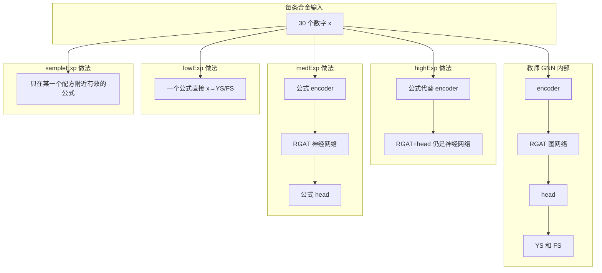

# symbolTorch 入门教程 — 把 GNN 预测模型变成可读公式

> 本 README 面向**零基础初学者**：不要求你熟悉 SymTorch、符号回归或图神经网络。按章节顺序阅读即可。

---

## 第 0 章：一句话说明白

你已经用 [`gnnDir`](../gnnDir) 训练好了一个**图神经网络**（GNN），它能根据合金配方预测 **YS**（屈服强度）和 **FS**（另一强度指标）。  
但 GNN 是「黑盒」：很难向老师或同事解释「为什么 Nb 升高预测会变大」。

**symbolTorch 做的事**：

1. 加载训练好的 GNN 当**教师**（不重新训练）；
2. 用工具 **SymTorch + PySR** 自动搜索**数学公式**，模仿教师某一段的计算；
3. 把公式存成 `.json` 文本，你可以直接复制进论文或 Excel；
4. 提供 **4 种难度/粒度** 的公式（见下文四档实验），按需选用。

**你不会学到**：如何从头训练 GNN（那是 `gnnDir` 的事）。  
**你会学到**：如何生成、阅读、使用符号公式。

---

## 第 1 章：先懂 6 个词（术语表）

| 术语 | 通俗解释 | 在本项目里指什么 |
|------|----------|------------------|
| **教师 (Teacher)** | 已经训练好的「标准答案」模型 | `best_ysfs_gat.pt`，即 RGAT_Dual |
| **符号蒸馏** | 用公式近似神经网络某一段 | 例如 `隐向量 ≈ 0.5 + Al*0.2 + …` |
| **PySR** | 自动搜公式的程序（遗传算法） | 在 CPU 上跑，第一次会装 Julia，较慢 |
| **SymTorch** | 把 PyTorch 模型和 PySR 接起来的库 | `pip install torch-symbolic` |
| **节点 / 样本** | 图上的一个点，对应一条合金数据 | 共 N 条，每条 30 个数字特征 |
| **图 (Graph)** | 样本之间连成的网，相似的配方会连边 | 推理时要用；lowExp 不用 |

**YS / FS**：训练标签，存在 `ys.pt`、`fs.pt`。FS 在训练时往往是 **log 变换后的值**；和原始 MPa 换算要用 `exp`（脚本里已处理评估）。

**30 维特征**：每条合金一行，30 个数，顺序固定（见 [第 3 章](#第-3-章输入数据长什么样)）。

---

## 第 2 章：四档实验选哪个？（初学者决策树）

四种实验在四个文件夹里，**共用同一个教师**，区别是「公式化网络的哪一段」：

```
你的问题                          → 去哪个文件夹
─────────────────────────────────────────────────
成分/工艺怎样影响模型内部表示？     → highExp
还想有「最终 YS/FS」的公式链？      → medExp（先跑 highExp 更省时间）
想要一个式子写进报告、不用图？       → lowExp
某一个配方为什么预测错了？          → sampleExp
```

| 文件夹 | 难度 | 大概耗时（--quick） | 公式里出现什么变量 |
|--------|------|---------------------|-------------------|
| [highExp](highExp/) | ★★☆ | 数十分钟～数小时 | Al, tem, coldway… |
| [medExp](medExp/) | ★★★ | 在 highExp 基础上加 head | 上面 + h0…h63 |
| [lowExp](lowExp/) | ★☆☆ | 约 1～2 小时 | Al, tem, coldway… |
| [sampleExp](sampleExp/) | ★★☆ | 每个节点约半小时+ | Al, tem…（局部） |

**初学者推荐路线**（按顺序做，不容易懵）：

```text
① 准备数据和教师（第 4 章）
② 跑 lowExp --quick     → 最快看到「一个总公式」
③ 跑 highExp --quick    → 理解「只公式化输入层」
④ 跑 sampleExp --quick  → 看一个难例配方的解释
⑤ 有时间再跑 medExp、完整版（去掉 --quick）
```

---

## 第 3 章：输入数据长什么样

### 3.1 文件在哪

默认目录：`metalForTi/gnnDir/gnndataPT/r-gatPT/`

| 文件名 | 初学者理解 | 形状 |
|--------|------------|------|
| `material_graph.pt` | 所有配方 + 图结构 | 节点数 N，特征 30 维 |
| `ys.pt` | 每条配方的 YS 真值 | N 个数 |
| `fs.pt` | 每条配方的 FS 真值（log） | N 个数 |
| `train_mask.pt` | 哪些用来「学公式」 | N 个 True/False |
| `val_mask.pt` | 哪些用来「考试算误差」 | N 个 True/False |

### 3.2 30 个特征的名字（公式里会出现）

与 CSV 列顺序一致，**不要打乱**：

```text
【成分 10 个】 Al, Zr, Sn, Mo, Cr, Nb, el_Si, V, Ta, Fe
【环境 2 个】  tem, fcr
【冷加工 18 个】 coldway_0, coldway_1, …, coldway_17
```

> 为什么 Si 写成 `el_Si`？因为符号数学软件里 `Si` 是保留字，会报错。

### 3.3 教师模型在哪

`metalForTi/gnnDir/gnn/r-gatDouble/runs/best_ysfs_gat.pt`

这是 `train_fs_gat.py` 训练结束后保存的「最好的一次」权重。  
**没有它，symbolTorch 无法运行。**

---

## 第 4 章：从零开始 — 环境安装（手把手）

### 4.1 你需要什么

- Linux 服务器或本机（教程以 Linux 为例）
- 已能跑通 `gnnDir` 训练（或别人给你 `.pt` 文件）
- 磁盘：预留数 GB（PySR 缓存 `sr_cache` 会变大）
- **不要用 gnnDir 的 Python 3.10 环境跑 symbolTorch**（会装不上 `torch-symbolic`）

### 4.2 创建 Python 3.11+ 环境

```bash
# 示例：用 conda 的 3.13（≥3.11 即可）
/root/miniconda3/bin/python3.13 -m pip install -r /home/data/metalTi/metalForTi/symbolTorch/requirements.txt
```

第一次安装 `torch-symbolic` 后，**第一次运行**还会下载 Julia，终端可能刷很多行，属正常现象，等它结束。

### 4.3 自检（强烈建议）

```bash
cd /home/data/metalTi/metalForTi/symbolTorch
/root/miniconda3/bin/python3.13 scripts/check_env.py
```

看到 `[OK] symtorch`、`material_graph.pt exists`、`Teacher ckpt exists` 再往下走。  
若报 `MISSING`，按脚本提示先完成 [第 5 章](#第-5-章准备教师和数据若还没有)。

---

## 第 5 章：准备教师和数据（若还没有）

在 **`gnnDir` 目录**执行（不是 symbolTorch）：

```bash
cd /home/data/metalTi/metalForTi/gnnDir

# 步骤 A：从 CSV 生成图数据（约 1 分钟）
python regenerate_rgnnpt.py --pt-bundle rgat

# 步骤 B：训练教师 GNN（初学者可先用少量 epoch 试通）
cd gnn/r-gatDouble
python train_fs_gat.py \
  --data-dir ../../gnndataPT/r-gatPT \
  --out-dir runs \
  --epochs 100
```

训练结束应出现：`runs/best_ysfs_gat.pt`。

再回到 symbolTorch 跑 `check_env.py` 确认通过。

---

## 第 6 章：第一次运行（复制粘贴即可）

```bash
cd /home/data/metalTi/metalForTi/symbolTorch

# 定义 Python（改成你机器上 3.11+ 的路径）
export PY=/root/miniconda3/bin/python3.13

# 最快体验：表格公式（约 1～2 小时，取决于 CPU）
$PY lowExp/run_distill.py --quick

# 完成后看结果
cat lowExp/runs/summary.md
cat lowExp/runs/ys_tabular_sym.json
```

**怎样算成功？**

- 终端最后一行类似：`Done. Outputs in .../lowExp/runs`
- 存在 `lowExp/runs/metrics.json` 和 `ys_tabular_sym.json`
- `ys_tabular_sym.json` 里 `equations["0"]` 是一段包含 Al、tem 等的字符串，不是空的

### 一键跑四档（可选）

```bash
chmod +x run_all.sh
./run_all.sh --quick
```

会依次执行 highExp → medExp → lowExp → sampleExp，**总时间较长**，适合挂机过夜。

---

## 第 7 章：每个文件夹是干什么的（详细）

### 7.1 总览图



### 7.2 各档「为什么这样做」和「好处」

**highExp** — 只把「配方 → 中间表示」变成公式  

- **为什么**：成分、温度、工艺是人能读的；公式若只含这些，最好懂。  
- **好处**：保留「相似配方互相关联」的图网络，预测更接近真实产线。  
- **代价**：encoder 有 64 个输出，完整跑 PySR 非常慢。  
- **教例**：[highExp/README.md](highExp/README.md)

**medExp** — 再加上「中间表示 → YS/FS」的公式  

- **为什么**：凑成两段公式，更像完整预测链。  
- **好处**：可复用 highExp 的 encoder，少跑很多遍 PySR。  
- **代价**：head 公式里是 h0、h1…，对初学者较抽象。  
- **教例**：[medExp/README.md](medExp/README.md)

**lowExp** — 完全不要图，只要 `YS = f(配方)`  

- **为什么**：写论文、做 Excel 最方便；也用来回答「构图有没有用」。  
- **好处**：运行最快、公式最少、最容易讲清楚。  
- **代价**：忽略「和相似合金互相影响」，精度可能下降。  
- **教例**：[lowExp/README.md](lowExp/README.md)

**sampleExp** — 只解释「这一条配方」  

- **为什么**：全局公式在难例上往往不准；局部公式更贴这一条的数据。  
- **好处**：适合写「案例分析：节点 575 为何预测偏高」。  
- **代价**：每个配方一套公式，不能当通用设计手册。  
- **教例**：[sampleExp/README.md](sampleExp/README.md)

### 7.3 共享代码 `common/`

四档共用的「工具箱」，一般**不用改**，只需知道存在即可。  
说明见 [common/README.md](common/README.md)（同样按初学者写法）。

---

## 第 8 章：命令行参数（初学者版）

每个文件夹里的 `run_distill.py` 都支持下面这些（记 4 个就够用）：

| 参数 | 干什么 | 初学者建议 |
|------|--------|------------|
| `--quick` | 少迭代、encoder 只算 4 维 | **第一次必加** |
| `--device cuda` | 有显卡时加速教师/RGAT | 有 GPU 就加；没有可省略 |
| `--data-dir 路径` | 换数据目录 | 用默认即可 |
| `--ckpt 路径` | 换教师权重 | 用默认即可 |

查看全部参数：

```bash
$PY lowExp/run_distill.py --help
```

**`--quick` 和完整版的区别（重要）**

| | `--quick` | 完整版（不加 quick） |
|--|-----------|----------------------|
| PySR 迭代 | 40 次 | 400 次 |
| highExp encoder | 只公式化 4 个隐层维 | 64 个维全做 |
| 目的 | 验证流程、看样例公式 | 写正式论文 |
| 时间 | 短 | 可能数十小时 |

---

## 第 9 章：跑完后看什么文件（看图指南）

以 `lowExp/runs/` 为例：

```text
runs/
├── ys_tabular_sym.json    ← 【最重要】YS 的公式，用记事本就能打开
├── fs_tabular_sym.json    ← FS 的公式
├── metrics.json           ← 数字：教师 vs 公式 差多少
├── summary.md             ← 两三行中文总结
├── teacher_predictions.pt ← 教师预测缓存（给进阶用）
└── sr_cache/              ← PySR 中间文件，可删
```

### 9.1 怎么读 `ys_tabular_sym.json`

```json
{
  "block_name": "tabular_ys",
  "equations": {
    "0": "0.48 + Nb * (-0.0012) + tem * 0.05 + ..."
  }
}
```

- 只有 `"0"` 一项：因为 YS 是**一个数**，只需要一个公式。  
- 字符串里会出现 `Al`、`coldway_3` 等：这就是该变量在公式里的名字。  
- 公式是**近似**，不是严格物理定律；以 `metrics.json` 误差为准。

### 9.2 怎么读 `metrics.json`

```json
"teacher": { "val_mae_ys": 0.58, "val_mae_fs": 0.87 },
"tabular_symbolic": { "val_mae_ys": 0.59, "val_mae_fs": 0.88 }
```

- **MAE**：平均绝对误差，**越小越好**。  
- `teacher`：GNN 教师对真实标签的误差。  
- `tabular_symbolic`：你的公式对真实标签的误差。  
- 两者接近 → 公式学得不错。  
- `graph_info_loss_*`（仅 lowExp）：公式比教师差多少；为正说明**图有帮助**。

---

## 第 10 章：GPU 还是 CPU？

| 阶段 | 用什么 | 说明 |
|------|--------|------|
| 搜公式 (PySR) | 主要是 **CPU** | 和 Julia 有关，和显卡关系不大 |
| 教师 / RGAT 预测 | **GPU 可选** | `--device cuda` 或默认 `auto` |
| 符号公式计算 | **CPU**（代码里固定） | 避免显卡上的一个技术报错 |

所以：**用 GPU 不会让整个蒸馏快很多**，但能加快教师算预测那一步。  
初学者有卡就：`run_distill.py --quick --device cuda`。

---

## 第 11 章：常见问题（初学者）

**Q1：`pip install torch-symbolic` 报 Python 版本不对**  
→ 必须 Python ≥ 3.11，换 `python3.13` 或 `python3.11`。

**Q2：第一次运行卡在 Installing Julia**  
→ 正常，等 5～20 分钟。不要 Ctrl+C。

**Q3：`FileNotFoundError: best_ysfs_gat.pt`**  
→ 先完成 [第 5 章](#第-5-章准备教师和数据若还没有) 训练。

**Q4：highExp 跑了很久正常吗？**  
→ 正常。encoder 完整版 = 64 维 × 2 分支 × 多次 PySR。先用 `--quick`。

**Q5：中断后能继续吗？**  
→ highExp/medExp 保留 `runs/*_encoder_sym.pt` 后重跑同一命令；或删 `sr_cache` 从头来。

**Q6：公式里 Si 变成 el_Si？**  
→ 故意为之，见 [第 3 章](#第-3-章输入数据长什么样)。

**Q7：四档都要跑吗？**  
→ 不必。按 [第 2 章](#第-2-章四档实验选哪个初学者决策树) 选一个即可。

---

## 第 12 章：目录结构（查文件用）

```text
symbolTorch/
├── README.md              ← 你正在读的入门总教程
├── requirements.txt       ← 依赖列表
├── run_all.sh             ← 一键跑四档
├── scripts/check_env.py   ← 环境检查
├── common/                ← 公共代码（四档共用）
├── highExp/               ← 实验 1 教例
├── medExp/                ← 实验 2 教例
├── lowExp/                ← 实验 3 教例（建议最先跑）
└── sampleExp/             ← 实验 4 教例
```

---

## 第 13 章：下一步读什么

1. 想**最快看到公式** → [lowExp/README.md](lowExp/README.md)  
2. 想**公式只含成分工艺** → [highExp/README.md](highExp/README.md)  
3. 想**解释某一个配方** → [sampleExp/README.md](sampleExp/README.md)  
4. 想改代码 / 查函数 → [common/README.md](common/README.md)

---

## 附录：引用

- SymTorch: https://arxiv.org/abs/2602.21307  
- 教师模型代码: [model_gat_double.py](../gnnDir/gnn/r-gatDouble/model_gat_double.py)
